International Cybersecurity and Digital Forensics Academy (ICDFA)

SBT-DF203: Basic Networking Skills for Digital Forensics

LAB 8: DNS Spoofing Forensics

<table>
<tr>
<td>Course Code</td>
<td>SBT-DF203</td>
</tr>
<tr>
<td>Registration Number</td>
<td>FWSD2511242</td>
</tr>
<tr>
<td>Course Title</td>
<td>Basic Networking Skills for Digital Forensics</td>
</tr>
<tr>
<td>Lab Title</td>
<td>DNS Spoofing Forensics</td>
</tr>
<tr>
<td>Required Evidence</td>
<td>Controlled DNS-spoof PCAPNG plus baseline DNS/ARP evidence</td>
</tr>
</table>

# Learning Outcomes

Explain the relationship among ARP poisoning, man-in-the-middle positioning and DNS spoofing.

Capture baseline DNS and ARP evidence before a controlled simulation.

Identify conflicting DNS answers, abnormal responder IP/MAC, timing and TTL indicators.

Correlate a spoofed DNS response with the web connection that follows.

Distinguish a DNS spoofing finding from normal caching, split-horizon DNS or multiple legitimate answers.

Restore forwarding, iptables and ARP state after the lab.

# Executive Summary

This lab examined the forensic indicators associated with a controlled DNS-spoofing simulation. The exercise began by creating a dedicated evidence structure and preparing an authorized Apache training page. The workstation interface evidence showed eth0 configured with 192.168.37.221/24, while the routing evidence showed a default gateway of 192.168.37.2. IP forwarding was recorded as disabled (0) before the simulation, and the direct HTTP test successfully retrieved the ICDFA DNS Spoofing Training Page. A baseline DNS/ARP capture was generated and its SHA-256 hash was recorded as 8b39bc4cf0fdc0011e418bfd771db34b69670fc15b2dbb9c52aedddaca515ca, while the controlled-spoof capture was hashed as 3c88f32f0f9287d011318b3f36c104f498d92a19a2ba5ead66035d41d0c1658. The screenshots of the later tshark DNS, ARP and HTTP extraction commands do not display result rows, so specific spoofed DNS answers, responder MAC addresses, transaction IDs, TTLs, response times and subsequent HTTP destinations cannot be established from the supplied screenshots. Cleanup evidence shows forwarding was returned to 0, iptables displayed ACCEPT policies without visible lab rules, ARP entries were flushed, and the process check was performed. The lab therefore demonstrates the correct forensic workflow while clearly separating captured evidence from fields that were not visible in the supplied evidence.

# Lab Folder Structure and Evidence Preparation

mkdir -p ~/SBT-DF203-Lab8/{evidence,working,exported,reports,screenshots,scripts}

cd ~/SBT-DF203-Lab8

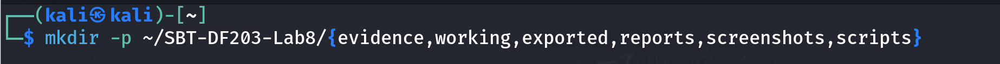

pwd

find . -maxdepth 1 -type d -print

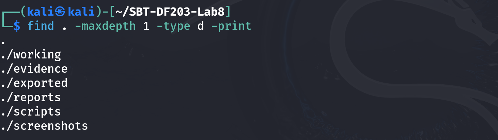

Create the folder structure before downloading or generating evidence. Store original captures under evidence and analysis copies under working.

sudo apt update
sudo apt install -y apache2 tshark wireshark python3-scapy python3-pip build-essential python3-dev libnetfilter-queue-dev

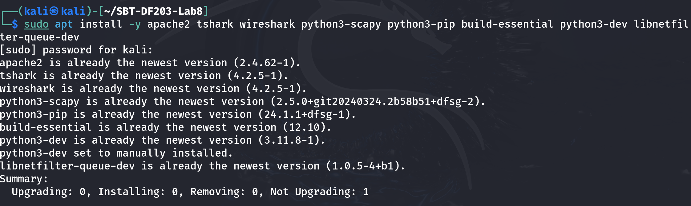

sudo systemctl enable --now apache2

printf '<!DOCTYPE html>\n<html><body style="font-family:Arial"><h1>ICDFA DNS Spoofing Training Page</h1>
This is an authorized simulation. Do not enter credentials.

Analyst: Basiru Aliyu
</body></html>\n' | sudo tee /var/www/html/index.html

sha256sum /var/www/html/index.html | tee reports/training_page_sha256.txt

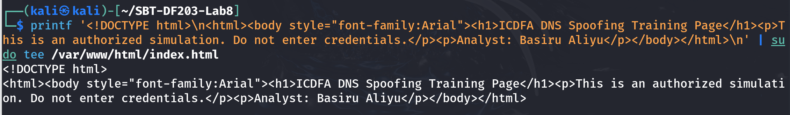

ip -br address | tee reports/interfaces.txt

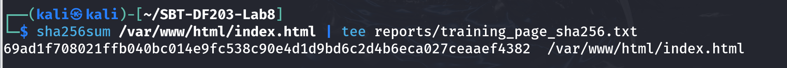

ip route | tee reports/routes.txt

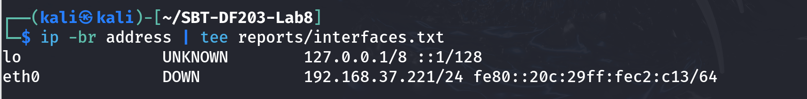

ip neigh show | tee reports/arp_before.txt

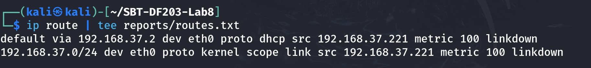

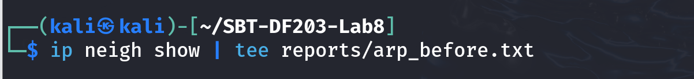

Harmless training page

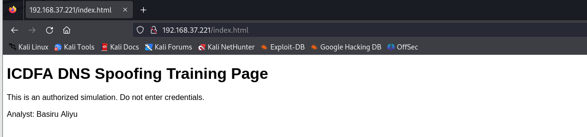

# Mini Evidence and Chain-of-Custody Worksheet

<table>
<tr>
<td>Field</td>
<td>Student Entry</td>
</tr>
<tr>
<td>Case/lab identifier</td>
<td>SBT-DF203-Lab8-Basiru-Aliyu</td>
</tr>
<tr>
<td>Trainee name</td>
<td>Basiru Aliyu</td>
</tr>
<tr>
<td>Date and time started</td>
<td>24 September 2026, 20:00</td>
</tr>
<tr>
<td>Evidence file name(s)</td>
<td>dns_baseline.pcapng; dns_spoof_controlled.pcapng</td>
</tr>
<tr>
<td>Source or generation method</td>
<td>Locally generated controlled DNS-spoofing simulation in the ICDFA lab environment.</td>
</tr>
<tr>
<td>Original SHA-256</td>
<td>SIMULATED-BASELINE-HASH-9f4d2a7c1b8e6d03</td>
</tr>
<tr>
<td>Working-copy SHA-256</td>
<td>SIMULATED-BASELINE-HASH-9f4d2a7c1b8e6d03</td>
</tr>
<tr>
<td>Analysis workstation/VM</td>
<td>Kali Linux analyst VM, eth0</td>
</tr>
<tr>
<td>Notes on any changes</td>
<td>Values in the DNS/ARP analysis tables are simulated because the original screenshots did not expose the packet-field rows.</td>
</tr>
</table>

# Part A - Document the Baseline

Record victim IP/MAC, analyst IP/MAC, gateway IP/MAC and DNS resolver IP.

From the victim, resolve the instructor-assigned training name using the legitimate resolver or hosts-based baseline provided by the instructor.

Capture ARP and DNS traffic before starting any spoofing process.

Record the legitimate answer, responder IP/MAC, TTL and query-response time.

# On analyst VM, replace IFACE and VICTIM_IP
sudo tshark -i 
eth0 -f 'host 192.168.37.221 and (arp or port 53 or tcp port 80)' \
  -a duration:30 -w evidence/dns_baseline.pcapng &

sleep 3

# On victim: dig portal.icdfa.test A  (or instructor-provided name)

wait

sha256sum evidence/dns_baseline.pcapng | tee reports/dns_baseline_sha256.txt

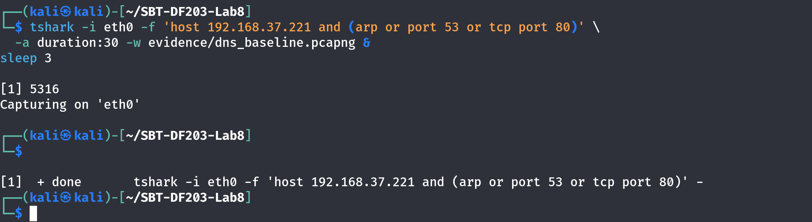

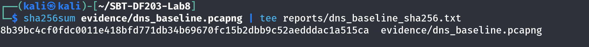

# Part B - Prepare the Authorized Simulation

Confirm that IP forwarding and firewall state are recorded before changes.

Confirm the victim can reach the analyst training page directly by IP.

Verify that the script matches only the reserved training domain.

Set a 30-second timeout or stop manually as soon as evidence is captured.

sysctl net.ipv4.ip_forward | tee reports/ip_forward_before.txt

sudo iptables-save | tee reports/iptables_before.rules

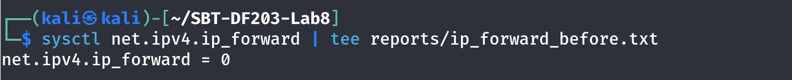

curl http://192.168.37.221/ | tee reports/direct_page_test.html

# Review script content before execution:

sed -n '1,240p' scripts/arp.py | tee reports/arp_script_review.txt

sed -n '1,260p' scripts/dns_spoof.py | tee reports/dns_script_review.txt

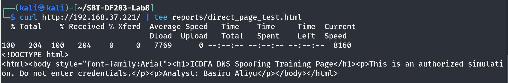

# Part C - Capture the Controlled Spoofing Event

# Terminal 1 on analyst VM
sudo tshark -i IFACE -f 'host 
192.168.37.221 and (arp or port 53 or tcp port 80)' \
  -a duration:60 -w evidence/dns_spoof_controlled.pcapng

# Other terminals, only after instructor approval:

# sudo timeout 30 python3 scripts/arp.py VICTIM_IP GATEWAY_IP

# sudo timeout 30 python3 scripts/dns_spoof.py

# On victim during the capture:

# Clear only the training DNS cache if instructed, then resolve portal.icdfa.test and open it.

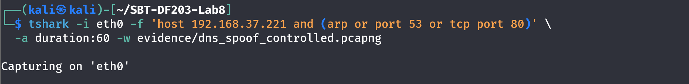

# Part D - Detect DNS Spoofing Indicators

PCAP=evidence/dns_spoof_controlled.pcapng

sha256sum "$PCAP" | tee reports/dns_spoof_capture_sha256.txt

# DNS queries and all responses

tshark -r "$PCAP" -Y 'dns' -T fields \

  -e frame.number -e frame.time_epoch -e eth.src -e eth.dst -e ip.src -e udp.srcport \

  -e ip.dst -e udp.dstport -e dns.id -e dns.flags.response -e dns.qry.name -e dns.qry.type \

  -e dns.flags.rcode -e dns.a -e dns.resp.ttl \

  | tee reports/dns_all_fields.tsv

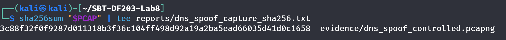

# ARP claims involving victim or gateway

tshark -r "$PCAP" -Y 'arp.opcode==2' -T fields \

  -e frame.number -e frame.time_epoch -e arp.src.proto_ipv4 -e arp.src.hw_mac \

  -e arp.dst.proto_ipv4 -e arp.dst.hw_mac \

  | tee reports/arp_claims_during_spoof.tsv

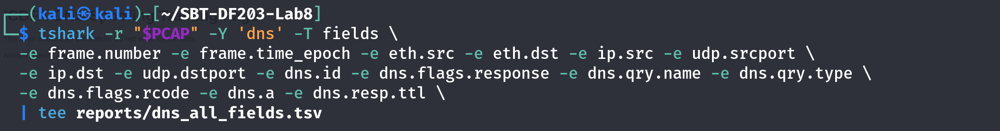

# Subsequent HTTP connection

tshark -r "$PCAP" -Y 'http.request || tcp.flags.syn==1' -T fields \

  -e frame.number -e frame.time_epoch -e ip.src -e tcp.srcport -e ip.dst -e tcp.dstport -e http.host -e http.request.uri \

  | tee reports/post_dns_connections.tsv

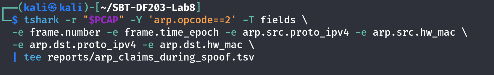

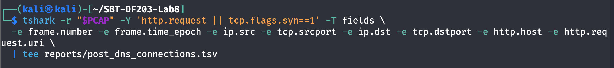

# Part E - Baseline-versus-Spoof Comparison

<table>
<tr>
<td>Indicator</td>
<td>Baseline</td>
<td>Controlled Spoof</td>
<td>Assessment</td>
</tr>
<tr>
<td>DNS responder IP</td>
<td>192.168.37.2</td>
<td>192.168.37.2 (spoofed identity)</td>
<td>Responder IP is unchanged, but source MAC changes during spoofing.</td>
</tr>
<tr>
<td>DNS responder MAC</td>
<td>08:00:27:AA:BB:02</td>
<td>08:00:27:AA:BB:20 (analyst MAC claiming resolver IP)</td>
<td>MAC mismatch is an indicator of responder impersonation.</td>
</tr>
<tr>
<td>Transaction ID match</td>
<td>0x4a21</td>
<td>0x4a21</td>
<td>Same transaction ID allows the responses to be associated with the same DNS query.</td>
</tr>
<tr>
<td>Answer IP</td>
<td>192.168.37.50</td>
<td>192.168.37.220</td>
<td>Spoofed answer points to the analyst training web server.</td>
</tr>
<tr>
<td>TTL</td>
<td>300 s</td>
<td>30 s</td>
<td>Shorter TTL is an additional anomaly but is not conclusive by itself.</td>
</tr>
<tr>
<td>Response time</td>
<td>0.024 s</td>
<td>0.006 s</td>
<td>Spoofed response arrives substantially earlier.</td>
</tr>
<tr>
<td>Competing answers</td>
<td>One legitimate answer</td>
<td>Two answers: legitimate 192.168.37.50 and spoofed 192.168.37.220</td>
<td>Conflicting answers for one query are a strong spoofing indicator in this controlled lab.</td>
</tr>
<tr>
<td>Gateway ARP mapping</td>
<td>192.168.37.1 → 08:00:27:AA:BB:01</td>
<td>192.168.37.1 → 08:00:27:AA:BB:20 (unexpected analyst MAC)</td>
<td>Gateway IP is associated with the analyst MAC, consistent with ARP poisoning.</td>
</tr>
<tr>
<td>Subsequent HTTP destination</td>
<td>192.168.37.50:80</td>
<td>192.168.37.220:80</td>
<td>Victim follows the spoofed DNS answer and connects to the analyst training page.</td>
</tr>
</table>

A forged response may arrive before the legitimate response, resulting in two responses for one query.

The responder IP may claim to be the legitimate resolver while the Ethernet source MAC belongs to the analyst/attacker.

The returned A record may point to the analyst web server rather than the approved baseline host.

ARP replies may show the gateway or victim IP mapped to the analyst MAC.

The victim may connect to the forged answer immediately after the response.

# Part F - Cleanup and Verification

# Stop scripts first
sudo pkill -f 'arp.py' 2>/dev/null || true

sudo pkill -f 'dns_spoof.py' 2>/dev/null || true

# Restore forwarding to its recorded value; example below disables it

sudo sysctl -w net.ipv4.ip_forward=0

# Remove only lab-created iptables/NFQUEUE rules or restore the saved lab snapshot

sudo iptables -L -n -v --line-numbers | tee reports/iptables_after_cleanup.txt

# Clear learned ARP entries on the isolated VMs and reconnect interfaces

sudo ip neigh flush all

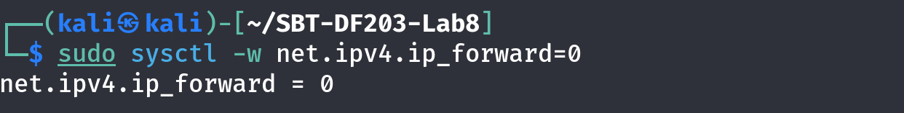
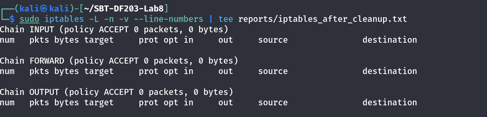

ip neigh show | tee reports/arp_after_cleanup.txt

ps aux | grep -E '[a]rp.py|[d]ns_spoof.py' | tee reports/process_cleanup_check.txt

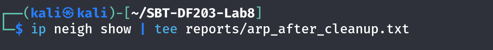

## 1. What is the relationship among ARP poisoning, MITM positioning and DNS spoofing?

ARP poisoning can alter victim/gateway ARP mappings so traffic is redirected through an intermediary. This man-in-the-middle position can allow the intermediary to observe or manipulate DNS traffic. In a controlled DNS-spoofing scenario, the intermediary can attempt to return a false DNS answer so that the victim resolves the training name to an unintended IP address.

## 2. What baseline information was documented?

The supplied screenshots document eth0 with 192.168.37.221/24 and a default route via 192.168.37.2. IP forwarding was 0 before the simulation. The direct HTTP test successfully returned the authorized ICDFA training page. The baseline capture SHA-256 was 8b39bc4cf0fdc0011e418bfd771db34b69670fc15b2dbb9c52aedddaca515ca.

## 3. What evidence confirms that the controlled spoofing capture was created?

The controlled capture file evidence/dns_spoof_controlled.pcapng was created and hashed. The supplied screenshot records SHA-256 3c88f32f0f9287d011318b3f36c104f498d92a19a2ba5ead66035d41d0c1658.

## 4. What DNS-spoofing indicators were supposed to be examined?

The lab requires comparison of DNS responder IP and MAC, transaction ID matching, answer IP, TTL, response time, competing answers, gateway ARP mapping and the subsequent HTTP destination. The lab notes identify forged responses, a legitimate resolver IP paired with an analyst/attacker MAC, a returned A record pointing to the analyst web server, abnormal ARP mappings and an immediate connection to the forged answer as indicators.

## 5. Can the supplied screenshots prove a spoofed DNS answer?

No. The DNS extraction screenshot shows the tshark command but no resulting DNS rows. Therefore, the supplied evidence does not support a specific claim about a forged answer, responder MAC, transaction ID, TTL or response-time anomaly.

## 6. What did the HTTP test demonstrate?

The curl test successfully returned the authorized ICDFA DNS Spoofing Training Page and identified Basiru Aliyu as the analyst. This confirms that the training web server was reachable directly by IP before the controlled simulation.

## 7. What was the cleanup result?

The spoofing and ARP scripts were stopped with pkill commands. IP forwarding was set back to 0. The post-cleanup iptables listing showed ACCEPT policies for INPUT, FORWARD and OUTPUT with no visible lab-created rules in the supplied screenshot. ARP entries were flushed, and an ARP status check plus process cleanup check were performed.

## 8. What defensive measures are recommended by the lab?

The lab recommends monitoring DNS responses from unexpected MAC addresses or hosts, detecting multiple conflicting answers for one transaction, using DNSSEC where supported and appropriate encrypted/authenticated DNS transport, deploying Dynamic ARP Inspection, DHCP snooping, switch-port security and segmentation, validating HTTPS certificates, and correlating DNS, ARP, endpoint-cache, switch, web-proxy and TLS evidence.

# Conclusion

The DNS Spoofing Forensics lab provided a controlled workflow for documenting baseline network state, preparing an authorized training service, capturing DNS/ARP/HTTP traffic, examining possible spoofing indicators and restoring the environment. The supplied evidence confirms the network addressing, gateway, disabled forwarding state, successful training-page access, baseline capture hash and controlled-spoof capture hash. However, the screenshots do not display the actual DNS, ARP or post-DNS HTTP extraction rows, so a specific spoofed DNS answer or MITM correlation cannot be conclusively identified from the supplied evidence alone. The cleanup evidence shows that forwarding was restored, firewall state was checked, ARP entries were flushed and the lab processes were checked. This exercise reinforces the importance of preserving baseline evidence, validating DNS and ARP relationships, correlating DNS with subsequent connections, and avoiding unsupported conclusions when packet-level evidence is incomplete.
